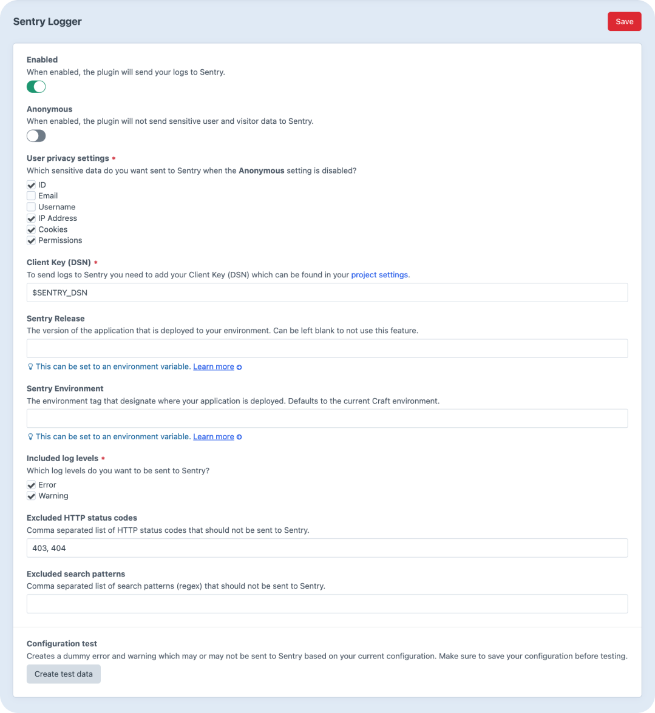

# Sentry Logger for Craft CMS

Pushes Craft CMS logs to [Sentry](https://sentry.io/) through a real Yii 2 log target.



## Features

- Updated to the latest and official Sentry SDK
- Native Yii 2 log target that is fully customisable
- All errors and warnings for each request are sent
- Plugin settings can be defined in the CP or with a config file
- Options passed when Sentry SDK initializes can be customized
- Calls for `Craft::error()` and `Craft::warning()` are sent and categorized
- Anonymous option to prevent sensitive visitors and users data from being sent to Sentry

**Additional data pushed to Sentry**

- Request type (web, ajax or console)
- Request method, headers and body
- Request route including query string
- Script executed including parameters (console request)
- User ID, email, username and groups (sensitive data)
- Visitor IP address (sensitive data)
- Visitor cookies (sensitive data)
- Database driver type and version
- Image driver type and version
- Craft edition, licence, schema and version
- Craft `devMode` status taken from general config
- Craft current environment taken from `CRAFT_ENVIRONMENT`
- Twig template path and line number for exceptions in compiled templates

## Requirements

This plugin requires PHP 7.2.5 or later and Craft CMS 3.5 or later.

## Installation

To install this plugin, search for **Sentry Logger** on the Craft Plugin Store and click **Install** or run the
following terminal commands in your Craft project folder to install it with Composer:

```bash
composer require diginov/craft-sentry-logger
php craft plugin/install sentry-logger
```

## Basic configuration

You can configure the plugin settings directly in the CP or you can create a `config/sentry-logger.php` config file
with the following contents. Make sure to update your `.env` environment file accordingly with the correct values.

```php
<?php

use craft\helpers\App;

return [

    '*' => [
        'enabled' => false,
        'anonymous' => false,
        'dsn' => App::env('SENTRY_DSN'),
        'release' => App::env('SENTRY_RELEASE'),
        'environment' => App::env('SENTRY_ENVIRONMENT'),
        'levels' => ['error', 'warning'],
        'exceptCodes' => [403, 404],
        'exceptPatterns' => [],
    ],

    'staging' => [
        'enabled' => true,
    ],

    'production' => [
        'enabled' => true,
    ],

];
```

## Advanced configuration

This is a better method because it adds this Sentry log target to the existing log component before loading any Craft
plugins or modules. This way you are assured that all logs are sent to Sentry.

Please note that this method override the basic configuration method.

To activate the advanced configuration, extend the `log` component in your existing `config/app.php` config file:

### Craft 3.6 or later

```php
<?php

use craft\helpers\App;

return [

    'components' => [
        'log' => [
            'targets' => [
                '__craftSentryTarget' => function() {
                    if (!class_exists('diginov\\sentry\\log\\SentryTarget')) {
                        return null;
                    }

                    return Craft::createObject([
                        'class' => 'diginov\\sentry\\log\\SentryTarget',
                        'enabled' => App::env('CRAFT_ENVIRONMENT') !== 'dev',
                        'anonymous' => false,
                        'dsn' => App::env('SENTRY_DSN'),
                        'release' => App::env('SENTRY_RELEASE'),
                        'environment' => App::env('SENTRY_ENVIRONMENT'),
                        'levels' => ['error', 'warning'],
                        'exceptCodes' => [403, 404],
                        'exceptPatterns' => [],
                    ]);
                },
            ],
        ],
    ],

];
```

### Craft 3.5 only

```php
<?php

use craft\helpers\App;

return [

    'components' => [
        'log' => function() {
            $config = App::logConfig();

            if (class_exists('diginov\\sentry\\log\\SentryTarget')) {
                $config['targets'][] = [
                    'class' => 'diginov\\sentry\\log\\SentryTarget',
                    'enabled' => App::env('CRAFT_ENVIRONMENT') !== 'dev',
                    'anonymous' => false,
                    'dsn' => App::env('SENTRY_DSN'),
                    'release' => App::env('SENTRY_RELEASE'),
                    'environment' => App::env('SENTRY_ENVIRONMENT'),
                    'levels' => ['error', 'warning'],
                    'exceptCodes' => [403, 404],
                    'exceptPatterns' => [],
                ];
            }

            return Craft::createObject($config);
        },
    ],

];
```

## Configuration parameters

This plugin adds a native Yii 2 log target that is an instance of the [yii\log\Target](https://www.yiiframework.com/doc/api/2.0/yii-log-target)
class. See the [Yii 2 API Documentation](https://www.yiiframework.com/doc/api/2.0/yii-log-target) for all available
properties.

### `enabled`

This required parameter is a boolean that indicates whether this log target is enabled.

### `anonymous`

This optional parameter is a boolean that indicates, when enabled, that this log target will NOT send sensitive visitors
and users data to Sentry.

### `userPrivacy`

This optional parameter is an array of sensitive user data that will be sent to Sentry if the `anonymous` parameter is 
set to `false`. Available values are `id`, `email`, `username`, `ip_address`, `cookies` and `permissions`. Defaults to 
all sensitive user data.

### `dsn`

This required parameter is a string that contain the Client Key (DSN) that Sentry gave you in your [project settings](https://sentry.io/settings/).

### `release`

This optional parameter is a string that contain the version of your application that is deployed to an environment.
See more information about [releases](https://docs.sentry.io/product/releases/) in Sentry documentation.

### `environment`

This optional parameter is a string that contain the environment tag that designate where your application is deployed.
Defaults to `CRAFT_ENVIRONMENT`. See more information about [environment](https://docs.sentry.io/product/sentry-basics/environments/)
in Sentry documentation.

### `options`

This optional parameter is an array of client options that will be passed to the Sentry SDK when it initializes. See
more information about [available options](https://docs.sentry.io/platforms/php/configuration/options/) in Sentry
documentation.

### `levels`

This required parameter is an array of log level names that this log target is interested in. Defaults to `error` and
`warning`. We have intentionally disabled reporting `info`, `profile` and `debug` log levels to Sentry because Craft
generates a lot of messages for these log levels.

### `categories`

This optional parameter is an array of message categories that this log target is interested in. Defaults to empty,
meaning all categories. You can use an asterisk at the end of a category so that the category may be used to match
those categories sharing the same common prefix. For example, `yii\db*` will match categories starting with `yii\db\`,
such as `yii\db\Connection`.

### `except`

This optional parameter is an array of message categories that this log target is NOT interested in. Defaults to empty,
meaning no uninteresting categories. If this property is not empty, then any category listed here will be excluded from
the `categories` parameter. You can use an asterisk at the end of a category so that the category can be used to match
those categories sharing the same common prefix. For example, `yii\db*` will match categories starting with `yii\db\`,
such as `yii\db\Connection`.

### `exceptCodes`

This optional parameter is an array of HTTP status codes that this log target is NOT interested in. This is a shortcut
for the `except` parameter to make it easier. Defaults to `403` and `404`, meaning that `yii\web\HttpException:403` and
`yii\web\HttpException:404` categories will be excluded from the `categories` parameter.

### `exceptPatterns`

This optional parameter is an array of text search patterns that this log target is NOT interested in. Defaults to 
empty, meaning no uninteresting text search patterns. These text search patterns are matched on the text of an 
exception message, error or warning. This is useful for filtering out text messages sent without an exception code such 
as those sent by the `Craft::error()` and `Craft::warning()` methods.

## Credits

Inspired by the [olegtsvetkov/yii2-sentry](https://github.com/olegtsvetkov/yii2-sentry) package and by official
[sentry/sentry-symfony](https://github.com/getsentry/sentry-symfony) and
[sentry/sentry-laravel](https://github.com/getsentry/sentry-laravel) packages. 
